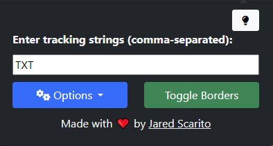
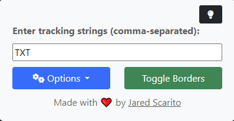
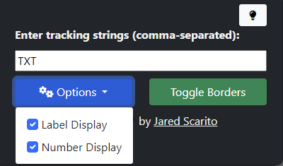
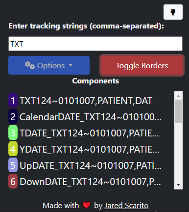

# ComponentsByID
## Summary
The idea for `ComponentsByID` is that you may have components on a webpage which correspond to data within your system's server-side. When debugging, it's very common that you may want to see what components are what on the UI side. The issue is, inspect element is lengthy and time-consuming to search for what you are looking for. Therefore, `ComponentsByID` was constructed to highlight and show you the components on the webpage matching or containing part of the IDs you supply to it. This makes debugging easier since you can see the components on the UI with their IDs in LIVE time rather than needing to use any pity `Inspect Element` tool to do your bidding...
## Screenshots

## Idea Origin
When working with components on the myAvatar NX application for my tenure at Netsmart, I realized there was some difficulty debugging things since the code was tied together by IDs for inputs within the application. To solve this, I figured an application like this would be some use.
## Installation
Load the `dist` folder as a `Load Unpacked` into your Google Chrome extensions page :)
## Licensing
This project will be licensed with the MIT license, so feel free to use it however you please. :)